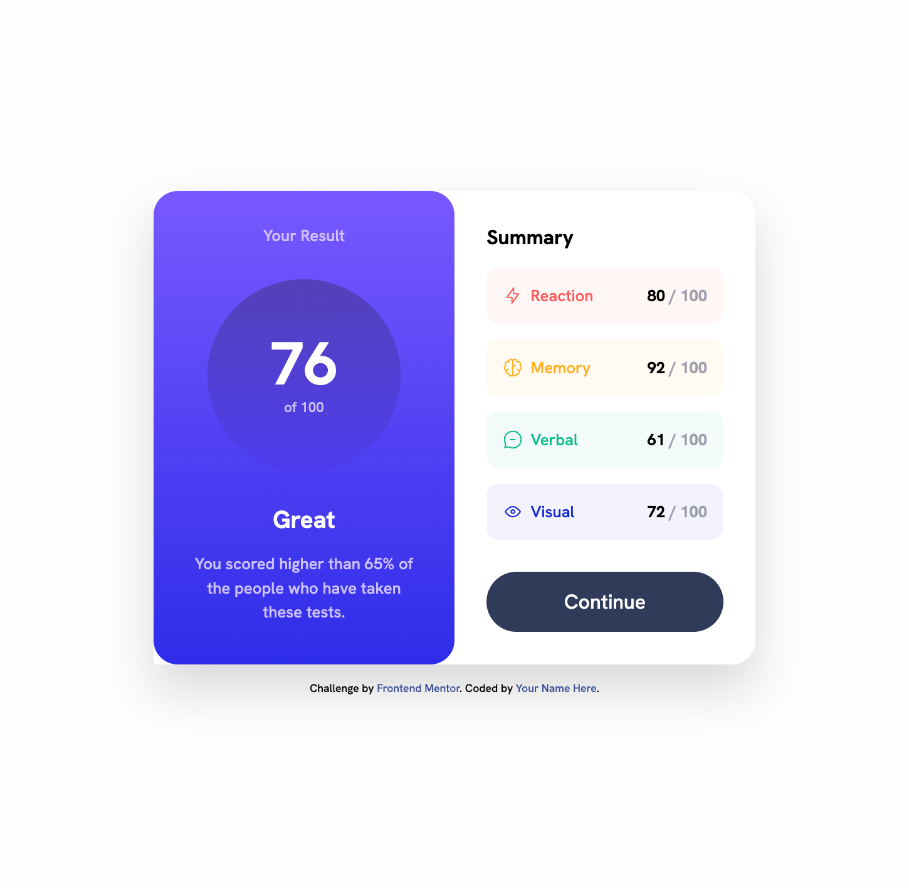
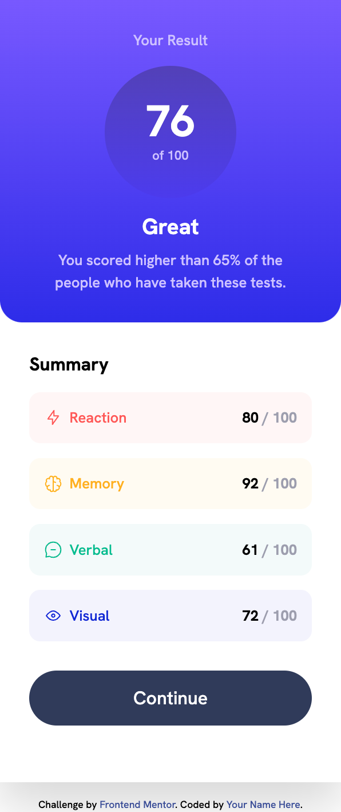

# Frontend Mentor - Results summary component solution

This is a solution to the [Results summary component challenge on Frontend Mentor](https://www.frontendmentor.io/challenges/results-summary-component-CE_K6s0maV). Frontend Mentor challenges help you improve your coding skills by building realistic projects.

## Table of contents

- [Frontend Mentor - Results summary component solution](#frontend-mentor---results-summary-component-solution)
  - [Table of contents](#table-of-contents)
  - [Overview](#overview)
    - [The challenge](#the-challenge)
    - [Screenshot](#screenshot)
    - [Links](#links)
  - [My process](#my-process)
    - [Built with](#built-with)
  - [Author](#author)

**Note: Delete this note and update the table of contents based on what sections you keep.**

## Overview

### The challenge

Users should be able to:

- View the optimal layout for the interface depending on their device's screen size
- See hover and focus states for all interactive elements on the page

### Screenshot

### Links

- Solution URL: [Repository](https://github.com/wemersonqueiroz/fem-results-summary.git)
- Live Site URL: [Live version](https://your-live-site-url.com)

## My process

### Built with

- Semantic HTML5 markup
- Tailwind Css
- Flexbox
- Mobile-first workflow

## Author

- Website - [Wemerson Queiroz](https://www.wemerson.dev)
- Frontend Mentor - [@wemersonqueiroz](https://www.frontendmentor.io/profile/wemersonqueiroz)
- Twitter - [@wemersonqueiroz](https://www.twitter.com/wemersonqueiroz)
